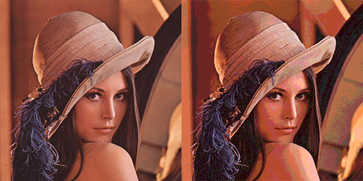
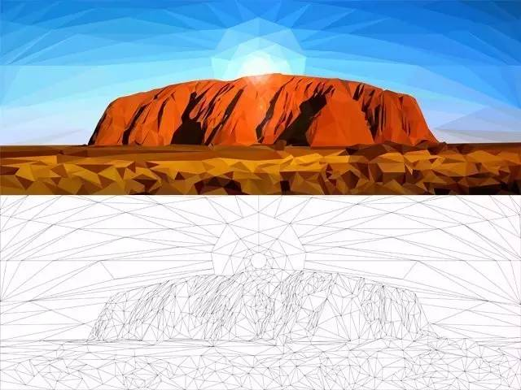
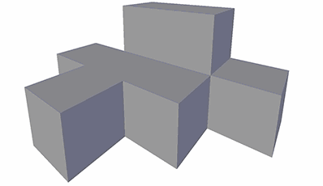
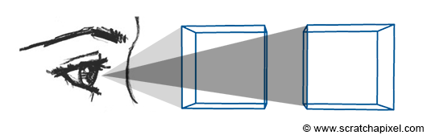
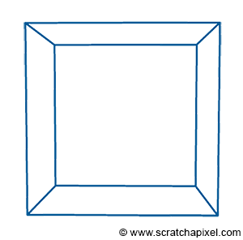

## 3D渲染基础知识

### 像素及分辨率

像素(pixel, 缩写px)，指图片显示的基本单位，pix是英语单词picture的常用简写，加上element得到，取自画像元素之意。px是一个点，它不是自然界的长度单位，谁能说出一个“点”有多长多大么？可以画的很小，也可以很大。如果点很小，那画面就清晰，我们称它为“分辨率高”，反之，就是“分辨率低”。所以，“点”的大小是会“变”的，也称为“相对长度”。

pt(point): **点**，也音译为**磅**，是印刷所使用的长度单位，用于表示字体的大小，也用于字距、行距等其他版面构成要素的长度。当代最通行的是广泛应用于桌面排版软件的 DTP(Desktop publishing)点，72 pt = 1 英寸。

#### 分辨率

##### 屏幕分辩率

例如，屏幕分辨率是1024×768，也就是说设备屏幕的水平方向上有1024个像素点，垂直方向上有768个像素点。
像素的大小是没有固定长度的，不同设备上一个单位像素色块的大小是不一样的。
例如，尺寸面积大小相同的两块屏幕，分辨率大小可以是不一样的，分辨率高的屏幕上面像素点（色块）就多，所以屏幕内可以展示的画面就更细致，单个色块面积更小。而分辨率低的屏幕上像素点（色块）更少，单个像素面积更大，可以显示的画面就没那么细致。

##### 图像分辨率

例如，一张图片分辨率是500x200，也就是说这张图片在屏幕上按1:1放置时，水平方向有500个像素点（色块），垂直方向有200个像素点（色块）。
在同一台设备上，图片分辨率越高，这张图片1:1放大时，图片面积越大；图片分辨率越低，这张图片1:1缩放时，图片面积越小。（可以理解为图片的像素点和屏幕的像素点是一个一个对应的）。
但是，在屏幕上把图片超过100%放大时，为什么图片上像素色块也变的越大，其实是设备通过算法对图像进行了像素补足，我们把图片放的很大后看到的一块一块的方格子，虽然理解为一个图像像素，但是其实是已经补充了很多个屏幕像素；同理，把图片小于100%缩小时，也是通过算法将图片像素进行减少。

最后，虽然不同设备上像素块大小会不一样，但是同一台硬件设备上的屏幕分辨率、像素块大小是不会变的。PC电脑上之所以可以调整屏幕分辨率，其实也是通过算法转换了

计算机屏幕主要是由一些离散的点组成，而现实世界(宏观上)是连续的。一个简单的例子，现实世界的绳子是连续的，而计算机中的被切成了一格一格的小块(也叫像素)，如下图所示

计算处理转换任何连续的对象（数学上的连续函数，数字图片的绳子）叫做离散化。而计算机图形学中的大多数问题都来自计算机所基于的技术本质: 0, 1 和像素。

对于许多看视频，玩游戏的人来说并不需要关注这些，但是如果你想要创建视频和3A大作，那这些就是你需要关心的事情。假设我们需要在屏幕上显示一个球体，我们在其上面应用一个网格，这些网格代表像素，如下图:

球与某些像素完全重叠，一些像素也为空，但是某些像素有些问题，球仅于它们部分重叠。在这种特殊情况下，这些像素我们用什么颜色填充？前景色还是球的颜色？

直观上，你可能会想“背景占像素块面积的25%，对象占75%，我们为该块分配一种颜色，该颜色由25%的背景色和75%的物体色组成”。那么如何去计算这些面积？一种可能的解决方案是将像素细分为子像素，并对背景重叠的子像素的数量进行计数，并假设对象覆盖了所有子像素。可以通过取与背景重叠的子像素数量占子像素总数的数量来背景覆盖的面积。

但是无论子像素多么小，总会有一些子像素与背景和对象重叠。这样一来，你可以很好地逼近对象和背景覆盖范围（子像素越小，逼近效果越好），但这始终只是一个逼近。电脑只能近似。可以使用不同的技术来计算该近似值，上面细分为子像素就是一种方式。计算机图形学源于必须用离散结构来“模拟”现实世界的连续结构。往往带来各种理解起来很简单，解决起来确很复杂的问题。

解决此方法的另一种方法，也就是提高图像的分辨率。换句话说，用更多的像素表示阴影形状(球体)。但是，也依旧受到屏幕分辩率的限制。

使用二维像素阵列来表示图像及屏幕显示该图像，分别称为光栅图形和光栅显示。术语 **栅格** 通常用于在显示区域内定义一个包含 x, y 坐标的网格。

计算机表示物体的图像主要的问题是物体的形状需要被“分解”为离散的像素。但是还有一些重要的问题，计算机中定义的数字受到对这些数字编码位数的限制，比如我们在屏幕上显示的颜色数受到用于编码RGB值的位数限制。在早期计算机中只有一位用来对屏幕上像素的“亮度”编码。当值为0时，像素是黑色，值为1时，像素为白色。第一代彩色计算机使用了8位编码(3位红色，3位绿色，2位蓝色)来表示颜色，只能定义 256($2^3 \times 2^3 \times 2^3$) 种颜色。那么当我们需要表示更多的颜色该怎么办呢？解决方案是找到一种(可以被计算机展示的)最匹配的颜色，并显示这种匹配的颜色。这种过程叫做颜色量化。

颜色量化的问题在于，当我们没有足够颜色来精确地表示采样连续渐变的色调时，连续的渐变就会以一系列离散的色带出现。这种效果叫做条纹(也叫做虚假轮廓)。如下图：

关于色带的问题现在基本上不用太担心，常见的图像使用32位进行编码，用32位总共可以显示1600万种颜色。

图像只是像素的集合，当真实世界的图像被存储在数字图像中，形状被分解为离散的结构，即像素。**光栅图像**（和光栅屏幕）的主要缺点是，我们可以存储或显示的图像的分辨率受到图像或屏幕分辩率的限制。放大不会显示图像的更多细节。矢量图形就是为了解决这个问题而设计的。对于**矢量图形**，不会存储像素，而是使用数学表达式表示对象的形状(及其颜色)。通过这种方式，文件中定义的形状不会受到图像分辨率的限制，而是可以再需要的分辨率下实时渲染，生成总是非常清晰的物体形状图像。

### 3D场景的构成

现实世界由形状，外观和结构千差万别的物体组成。例如构成海洋的烟雾，椅子和水等。在计算机图形学中，我们通常希望将对象视为实体或非实体。然而，在现实世界中，唯一能够将两者区分开的是组成这些物体的密度。烟雾由彼此松散地链接并被大量空间隔开的分子组成，而组成椅子的木头是由紧密地堆积在最小可能空间中的分子制成的。

前面讲了计算机如何渲染二维图片，而对于三维的形状，也是由基本的(三维)点组成。我们给二维的X，Y增加一个Z轴，现在我们通过 X，Y，Z 就可以来定义一个点。我们简单地定义空间中的几个点，并将它们相互连接以定义一个面(一个多边形)。注意，多边形应该始终是共面的，这意味着构成一个面或多边形的所有点应该位于同一个平面上。使用三个点，我们可以创建一个最简单的多边形-- 三角形。当面或多边形有三个以上的(顶)点时，将这些面转换成三角形是很常见的，这个过程叫做**三角剖分**。

图: 所有3D 对象的基本单元是一个三角形。一个三角形可以通过连接(2D 或3D)3个点或顶点来创建。将三角形组合在一起可以创造出更复杂的形状。

​							  图：低多边形(这里是三角形，低就是边比较少的意思)2D矢量图

​																		           3D三角剖分

我们如何用三角形去显示一个曲面？在CG中使用三角形或多边形定义物体表面是对现实一种非常粗糙的展示。通常我们看起来非常平坦的的表面，在围观层面上是一个很复杂的景观。有趣的是物体的显微结构对它们的外观有很大影响，但却对不影响它们的整体形状。使用三角形确实不是表示曲面的最佳方式，它实际上是给物体一个面的外观，有点像一个切割的钻石(这个面的外观我们可以使用平滑阴影的技术去改善)。

如果你画一条曲线，你可以沿着这条曲线放置几个点，并用直线(线段)连接这些点来近视表示这条曲线。

为了改善这种近似，我们可以沿这条曲线放置更多的点。将(顶)点沿光滑表面实际放置的过程叫做采样(将光滑表面沿三角形网格放置的过程叫镶嵌)。同样，对于3D形状，我们可以创建更多更小的三角形来更好地逼近曲面，当然，创建的几何体(三角形)越多，渲染这个对象所花的时间就越长。这就是为什么，渲染艺术往往是找到一个几何体数量与你近似平滑渲染这个3D对象花费的时间之间的权衡。你放在三维模型中的几何细节数量也取决于你离这个物体的距离。你离对象越近，你能看到的细节就越多。处理模型的复杂性也是CG中很大的研究领域。

基本上，用多边形或三角形渲染完美的圆或完美的球体是不可能的。计算机工作在离散的结构上，显示器也是。如果只是使用光栅屏幕来显示形状，那么渲染器基本上没法完美的渲染出圆圈一样的形状。当然，也有相应的解决方案(已经存在了几十年)，就是使用小于一个像素的三角形，在这一点上，没人看着显示器可以告诉你基本元件是一个三角形。这个想法在皮克斯(Pixar)的RenderMan等高质量的渲染软件中得到了广泛的应用，在过去十年中，它也作为镶嵌的一部分出现在实时应用中。

多边形网格很容易定义，这就是为什么它们很流行的原因，基本上我们在CG故事片或视频游戏中看到的大多数物体都是作为一个多边形或三角形的组合来定义的。但是这种方式也存在缺陷，正如前面所提到的，它们对于建立曲线或有机表面的模型不是很好。当计算机被用于设计像汽车(CAD)之类的制造对象时，这就成了一个特殊的问题。当然为了解决这一问题，出现了NURBS(非均匀有理B样条，Non-Uniform Rational B-Splines)和细分曲面设计。其中贝塞尔曲线就是NURBS的一个子集。在该设计中，点只是控制一个网格，从这个网格可以计算出一个精确的曲面，表面本身只是一个方程的结果，所以它不能直接渲染，真正需要渲染的时候，需要对其进行采样（有点类似我们初中画函数图像）。通过这种方式，我们可以用更少(相对于多边形光滑表面所需点数来说)的控制点来控制一个完全光滑的表面形状，然后可以转换成一个比原始输入控制网格更平滑的三角形网格。

虽然用多边形创建曲面是可能的，但是和NURBS及细分曲面只用几个点就可以定义相似的形状比起来需要花费的时间更多，而且准确度更低，但是我们为什么没有广泛使用它？与多边形网格相比，它们在渲染时更具扩展性，但是需要额外的步骤，首先生成控制网格，再从控制网格生成多边形网格。这也是很多视频游戏并不用它们的原因，尽管部分游戏引擎实现了这个功能。另外NURBS整体上比多边形网格更难操作，这也是为什么艺术家通常用细分曲面去替代。但在需要高度精确的设计和CAD的是很常用的。

​																			图: 细分曲面

大多数情况下，3D模型是手动生成的(3D建模师)。这里说的手动，是指有人在实际的3D空间中创建了顶点，并将它们彼此连接起来以构成对象的面。但是，也可以用仿真软件来生成几何图形，比如我们制造水，烟或火的方式。特殊的程序可以模拟流体运动的方式，并根据此模拟生成多边形网格。在冒烟或起火的情况下，该程序不会生成表面，而是生成3D尺寸的网格(将矩形或矩形框划分为等间隔的单元格，也称为 **体素** 或 体积元素 )。网格的每个单元都可以看作是一个很小的空间，该空间是空的或被烟雾占据。

当然，如果更复杂的图形，也可以使用 **隐式曲面**，所谓隐式曲面，就是针对一个几何体，我们可以建立一个数学表达式，我们可以针对多个几何体数学公式来进行渲染，比如几何体A中不包含几何体B的部分，http://www.cad.zju.edu.cn/home/jin/3danimationcourse/implicit.pdf

通过隐式曲面创建(将诸如球体，立方体，圆锥体等组合在一起)更复杂的形状的技术，被称为**构造实体几何**。元球造型就是创建有机形状的另一种隐式几何形式。如下图：

现在我们有了3D场景中最重要的几何体，但是我们还需要灯光，没有灯光的场景是黑色的，同样，我们也需要有一个能够观察场景的相机。几何体(一个或多个3D对象)，灯光，相机就是构成一个场景最基本的元素。

​																					3D体素动画

​																						2D像素动画

### 在屏幕上显示3D对象

3D场景的图像可以以多种方式生成，但不管哪种方式对于相同的场景我们都应该生成相同的图像。大多数情况下，渲染的目的是为了创建逼真的图像(也可以创建非逼真的图像或NPR(non-photorealistic rendering))。那么，什么是真实呢？真实感就是需要我们创建一个“真实”的图像，或者(不存在摄影)在我们眼里看起来像真实(比如镜子里看到的)。如何做到？通过了解现实世界的规律，然后在计算机上模拟这些规律。换句话说，渲染就是尽可能的模拟我们现实世界的规律。这个世界上的规律有很多，比如使物体下落的重力，但是这些和物体的外观无关。所以在渲染中，我们所感兴趣的就是使物体看起来像它们，本质上就是光在空间中传播并与物体相互作用的结果。而这，就是我们需要在模拟的。

#### 透视投影

通过平时的经验我们可以知道，同一个物体离我们越远，它看起来就会比实际的小。也就是所谓的透视效应。

当我们需要在平面上创建世界图像，一种基本方法是从对象的角到眼睛的线描并找到这些线与假想的画布表面的焦点。然后将这些交点彼此连接，以重新创建对象的边缘。将3D的点投射到画布表面的过程称为透视投影。

通过此技术，我们可以在平面上创建对象的框形。在计算机图形学中的渲染称为线框，也就是只绘制对象的边缘。

当然，在实际中，如果物体不是透明的，盒子的正面应当遮挡或隐藏背面。所以在渲染中解决的问题之一，不仅是将几何图形投射到场景上，还需要确定几何图形哪一部分是可见的，哪一部分是隐藏的。而针对这个过程，也有许多不同的名称：**隐藏表面消除**，**遮挡剔除** 和 **可见表面确定**。为啥这么多名字？因为这是渲染中第一个主要问题，所以早期阶段对该领域的研究较多。当以不同的方式，是去找隐藏面(进行剔除)还是找哪些该显示时，就会产生不同的名称。不管以哪种方式，最终都需要产生相同的图像，但是会导致设计不同的算法(其中一种算法可能比另一种算法更好)。

#### 正交投影

也叫平行投影，物体在投影面大小与距离没有关系。就像我们数学几何课上老师教我们画的效果，对于在三维空间内平行的线，投射到二维空间中也一定是平行的。

透视投射一般用于模拟人眼睛的行为，而正交投影一般用于编辑器编辑场景，而场景中的相机，就是模拟我们人眼所在的位置。

通过投影，我们知道了如何在平面上表示3D物体的形状，但是物体并不仅仅由它的形状决定，还由它的外观(颜色，质地，亮度等)决定。一个物体的外观，可以定义为这个物体由什么材料制成，并与光如何相互作用的。我们知道光在空间中沿直线传播，当它与一个(不透明的)物体接触时，可能会发生两件事，可以被物体吸收，可以反射回环境。当光线从物体表面反射回来，它会继续移动(可能会朝着最初方向不同的方向)，直到它接触到另一个物体(这种情况下，这个过程会重复，光线被吸收或反射)，或者达到我们的眼睛。

在CG中，通常并不会试图模拟光与原子相互作用的方式，而是在物体层面模拟光的方式。在数学上计算一个网球在物体表面反弹很简单，但是在微观层面，物体表面一般都不是平的，这就会导致光在各个方向上发生反射(某些情况下几乎是随机的)。从远处看一个物体(汽车，水果等)，我们看不到它们的显微结构，虽然它们对物体外观有很大影响。当然，计算机也不会在微观层面上去描绘物体，因为所需的几何体数量太过庞大，计算机内存吃不消。妥协的方案是用**另一个数学模型，在微观层面上模拟光和任何给定材料的相互作用方式**。简言之，就是 **着色器**。

所谓渲染，就是模拟光在空间中的传播方式。光线从光源发出，被物体表面反射，其中一部分最终到达我们的眼睛。这就是我们如何看到周围的物体。前面提到，追踪光线路径从光源进入眼睛不是一个有效的方式，当一个光子(或一束光线)在物体表面反射后的方向，可能会向眼睛方向移动，但是我们眼睛本身很小，实际上会更可能错过它。虽然编写程序来模拟自然界中发生的光的传输并不是不可能(这种方式叫做 **前向追踪** )，但是，实际上效率很低下，实践中并不会用到。

一个更加有效的解决方案是，沿着光的路径，反过来，从眼睛到光源。因为我们是从沿着自然光的路径倒退，所以我们把这种方式称为 **倒退跟踪** 或 **反向跟踪**。

#### 光栅化渲染

光栅化，就像我们沿着一条(过几何体表面的的点到眼睛点的)线移动过几何体表面的点，直到它“躺在”画布表面上。当然这条线只是隐含的，实际上我们并不需要它，通过它，可以直观地解释投射过程。

当然，可能存在这样的情况，场景中的几个点p, p1, p2等，都投射到画布(也就是屏幕表面)同一个点p' 上。然而，通过相机实际可见的唯一点是连接眼睛和所有这些点的线上最接近眼睛的点。

当然，为了实际的显示图像，我们需要将所有点都投射到屏幕上。原来的三角形(或多边形)物体分解为小的几何元素，当投射到屏幕上时，不会超过一个像素。同时将该点到眼睛的距离存在一个特殊的列表(称为深度列表)中，由该像素维护。在处理结束时，按照距离的顺序对每个像素列表中的点进行排序。这样，就可以使得任何给定像素可见的点，是该像素列表中的第一个点。这种方法也被称为深度排序算法。对物体深度(表面上的点)进行排序的概念是所有光栅化算法的基础。其中著名的有 **z缓冲算法**，**Painter算法(画家算法)**，**纽厄尔算法** 等。

目前基本上所有的显卡都使用Z缓冲算法来生成图像。

光栅化就是将(物体上的)点投射到屏幕上，找到它们在图像平面上各自的位置。但是反过来，我们也可以从像素开始，将其装换为图像平面上的一个点。也就是说我们先有了p'，然后从眼睛开始，追踪一条光线，穿过p’，并将其延伸到场景中。如果光线与物体相交，那么我们就知道交点p，实际上就是该像素可见的点。简而言之，光线追踪是一种解决点的可见性问题的方法，显示地追踪光线从眼睛向下到场景。

光线追踪和光栅化实际上是彼此相反的。光追是从眼睛到物体，而光栅化是从物体到眼睛。虽然二者功能一样，都能找到实际可见点，但是它们需要解决的问题完全不同。光线追踪是一个复杂的问题，需要解决射线-几何相交的问题。而我们知道，几何很复杂，有平面几何(三角形，矩形...)，立体几何(球体，立方体...)，总之看着就让人头大。当然，这也体现出光追的强大之处，只要存在光线与场景可能包含(或者渲染器可能支持)的任何类型的几何图形的交集的技术，就可以使用光线追踪。

与其计算光线与所有几何的交叉点，那么我们能不能只计算与单一的几何图形的交点，然后再将其他几何图形转化为这单一的几何图形呢？答案当然是可以，那就是三角形。我们知道几何中最简单的图形就是三角形，大多数时候，所有的几何图形都可以转换成三角形网格，这也意味着实现射线几何交叉测试就不用测试每个几何类型，只需要测试三角形就可以了。从编码角度来看，只实现一种方式处理所有图形，要比实现多种方式来处理不同的图形要简单的多。

#### 光照和阴影

图像渲染的丰富效果很大程度上也要归功于光与影的利用。为了使计算机模拟丰富的光照效果，人们提出了几种不同的光源模型（环境光，平行光，点光源，聚光灯等），在不同场合下组合利用，可以达到很好的光照效果。

环境光类似一个整体的光照效果，

平行光类似太阳光(相对于地球上物体尺度而言，太阳离我们足够远)。对于任意平面，平行光照射的亮度都是相同的，而与平面所处的位置无光。

点光源是不记光源大小，可以看做一个点发出的光源。点光源照射到不同物体表面的亮度是线性递减的，离光源距离越远的物体会显得越暗。

聚光灯是一种特殊的点光源，能够朝着一个方向投射光线。

根据生活中的例子我们知道，距离光源位置越远的，看起来就越暗，距离越近的，看起来就越亮。在渲染中也是如此，当我们将顶点映射到屏幕像素之后，我们需要根据物体原来的纹理，给每个多边形或三角形填充纹理，以及根据光源的位置关系，使每个面更亮或更暗。通过这种方式，我们就可以生成一个很逼真的3D物体。

当然，在光栅化渲染中，阴影都是假的，阴影效果都是预先计算的。根据环境中的光照，我们决定哪里需要添加阴影，之后再通过某种算法，模糊阴影的轮廓。而具体就是靠美工凭借经验对现实进行模拟，并不是真正的计算。而光线追踪，就可以如实反映光源的特性(比如反射，折射等)。

光线追踪技术可以通过车门的反射看见被挡住的火焰。

光线追踪技术可以让地面上的水反射出很远处的房子。

参考来源：https://zhuanlan.zhihu.com/p/134158574

光追技术，其算法最早是1979年由TurnerWhitted提出，直到2006年，皮克斯的《Cars》才开始使用这项技术用于光线渲染。主要问题就在于，需要的计算量过于庞大。

现在，我们有了模型，光照，相机。还有最后一步，就是“纹理”，这里的纹理指的的外观，而不是手感。比如同样的模型，光源，相机，我们使用不同的纹理就可以得到不同的渲染效果：

​																			塑料效果(左)卡通效果(右)

通过以上这些方式，我们就可以建造更大的场景。重要的是，再大的场景，过程都是一样，处理多边形，填充，光照，纹理化。当然，也有集中方法可以加速渲染，首先可以为这种运算做专门的硬件，让运算更快，其次，我们可以把3D场景分解成多个小部分，然后并行渲染，而不是顺序渲染。为此，有了专门的处理器—— **GPU**，Graphics Processing Unit。GPU在显卡上，周围有专门存储网格和问题里的地方，让GPU的多个核心可以高速访问。现代显卡，比如3060Ti就有4864个核心，提供大规模并行处理，每秒处理上亿个多边形。

显卡如何实现光追？在显卡中有一部分专门用于光线追踪服务，称为RT Core。当收到光线追踪请求，就会交给RT Core来处理，RT Core利用BVH（Bounding Volume Hierarchy Traversal，层次包围盒遍历）算法，把一个物体划分为N个包围盒，如果与某一个包围盒相交，则继续划分为N个小的包围盒，直到找到最终光线具体相交的三角形。

光线追踪技术不光是给用户带来了更真实的游戏画面，光追显卡还可以减轻游戏开发难度，很多从事室内设计的人员并没有任何计算机图形学的基础，经过简单的布置和设置灯光，就能实现照片级别的画质，光线追踪技术显卡在将来一定程度上可以改变行业的发展。

当然，不只是光追，现在也有很多新技术，比如**DLSS**(Deep Learning Super Sampling，深度学习超级采样)，也被称为大力水手。利用深度学习和AI的强大功能来训练GPU渲染清晰游戏图像——简单来说，就是利用低分辨率生成图像后放大分辨率，再利用AI算法填充细节像素，让低分辨率渲染细节效果尽可能接近高分辨率下的原生渲染效果。

当然，这些技术在游戏应用中还不成熟，我们作为消费者也不能盲目追求购买，也不要觉得它是不怎么实用的智商税。游戏厂商和显卡厂商都在不断的发展，总之，未来可期。

