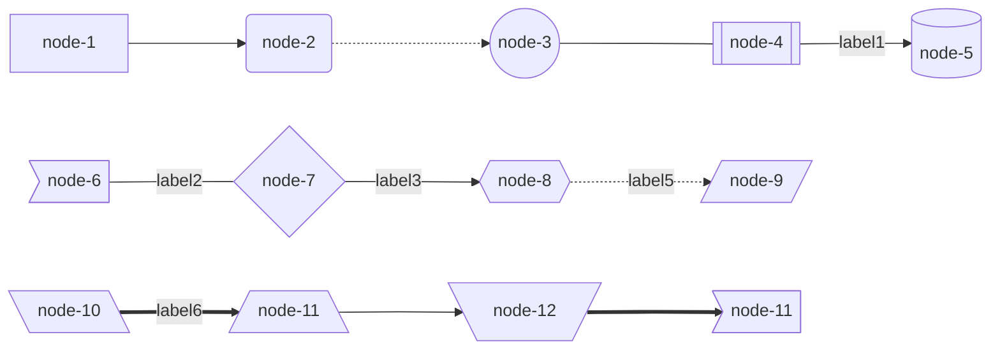
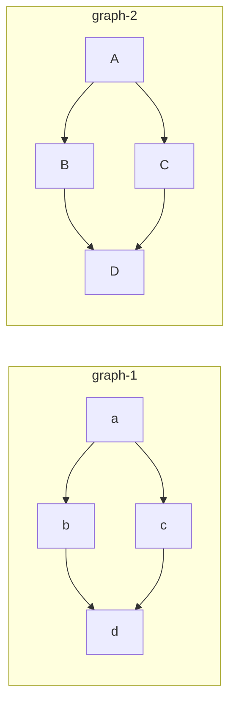
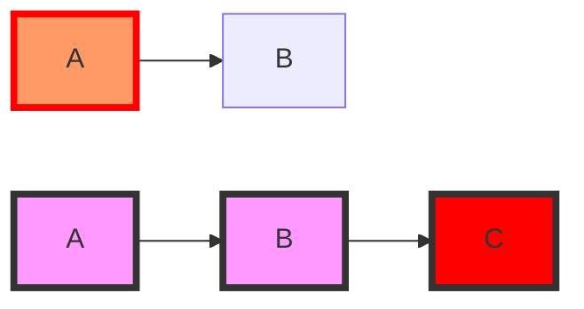

## 节点及连接线

```mermaid
graph LR
	node-1 --> id1(node-2) -.-> id2((node-3)) --- id3[[node-4]] -- label1 --> id4[(node-5)]
  id5>node-6] ---|label2|id6{node-7} -->|label3| id7{{node-8}} -. label5 .-> id8[/node-9/]
  id9[\node-10\] ==label6==> id10[/node-11\] --> id11[\node-12/] ==> id12>node-11]
```

```mermaid
graph LR
	subgraph graph-1
		a--> b & c -->d
	end
	subgraph graph-2
		A --> B
		A --> C
		B --> D
		C --> D
	end
```

## 节点样式

### 通过style给节点添加样式

```mermaid
graph LR
    id1(Start)-->id2(Stop)
    style id1 fill:#f9f,stroke:#333,stroke-width:4px
    style id2 fill:#bbf,stroke:#f66,stroke-width:2px,color:#fff,stroke-dasharray: 5 5
```

### 通过class给节点添加样式

```mermaid
graph LR
    A:::classA --> B
    classDef classA fill:#f96,stroke:red,stroke-width:4px;
    
    node1[A] --> node2[B] --> node3[C]
	  classDef className fill:#f9f,stroke:#333,stroke-width:4px;
		classDef class2 fill:red,stroke:#333,stroke-width:4px;
		class node1,node2 className;
		class node3 class2;
```

```mermaid
graph LR
	
```

