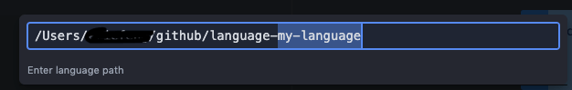

# 如何从0开发一个Atom插件

[官方文档](https://flight-manual.atom.io/hacking-atom/sections/package-word-count/)

Atom是一个Electron应用，是使用JavaScript来开发的桌面应用，所以对于前端来说，开发插件是一件很容易的事。  

根据Atom的官方文档，查看关于创建插件的相关操作:  

首先在Atom中打开命令面板`cmd` + `shift` + `p`，输入pkg  


由于我们需要创建一个course解析器，所以选择 `Package Generator: Generate Language Package`，按下回车，会出现一个对话框，在框中输入要建立的包名回车后即可完成创建  



Atom会生成一套默认的文件结构，并打开一个新的窗口。同时该package会自动链接到Atom的packages，当修改完代码，通过 `cmd+ctrl+alt+l` reload 窗口就可以应用最新的代码变更。

## 项目结构

生成的插件目录如下

```bash
language-my-language                    
├── CHANGELOG.md
├── LICENSE.md
├── README.md
├── grammars                                 // 提供语法文件，*.json / *.cson
│   └── my-language.cson
├── package.json
├── settings                                 // 存放设置文件
│   └── language-my-language.cson
├── snippets                                 // 存放语法段落
│   └── language-my-language.cson            
└── spec                                     // 存放测试用例
    └── language-my-language-spec.coffee
```

package.json

和node模块一样，Atom packages包含一个顶级目录的`package.json`。这个文件中包含这个package的metadata。

除了一些可用的常规Node `package.json` key之外，Atom `package.json`文件还具有自己的附加功能

- `main`: Javascript文件路径，即package的入口。如果缺少此属性，则Atom将默认查找`index.coffee`或`index.js`
- `styles`: 一个字符串数组，用于标识该package需要加载的样式表顺序。如果未指定，则将`styles`目录中样式表按字符顺序添加
- `keymaps`: 一个字符串数组，用于标识该package需要加载的快捷键映射文件。如果未指定，按字符表顺序加载`kaymaps`目录中的文件
- `menus`: 一个标识菜单项映射的字符串数组，如果未指定，按字符表顺序加载`menus`目录中的文件
- `snippets`: 一个标识snippets的字符串数组，如果未指定，按字符表顺序加载`snippets`目录中的文件
- `activationCommands`: 一个用于识别该package激活的命令的对象. key是css选择器，值是标识命令的字符串数组。在css选择器定义的关联范围内触发这些事件之一之前，将延迟package的加载。如果未指定，则调用`main`中导出的`activate()`方法
- `activationHooks`: 一个字符串数组，用于标识package激活时触发的钩子。在触发这些钩子之一之前，将延迟包的加载。当前有3个激活的钩子:

  - `core:loaded-shell-environment`: 当Atom完成加载shell环境变量时
  - `scope.name:root-scope-used`: 当一个指定语言的文件被打开时(e.g. `source.ruby:root-scope-used`)
  - `language-package-name:grammar-used`: 当一个指定语言的package被使用时(e.g. `my-special-language-javascript:grammar-used`)
- `workspaceOpeners`: 一个用于标识触发包激活的URI数组。例如，假设你的package注册了一个自定义打卡器`atom://my-custom-panel`。通过包含`workspaceOpeners`的string，该package将延迟到该URI打开后激活

目前创建的`package.json`看起来如下:

```json
{
  "name": "language-my-language",
  "version": "0.0.0",
  "description": "A short description of your language package",
  "keywords": [
    "language",
    "grammar"
  ],
  "repository": "https://github.com/atom/language-my-language",
  "license": "MIT",
  "engines": {
    "atom": ">=1.0.0 <2.0.0"
  }
}
```

#### Source Code

如果想扩展Atom的行为，package需要包含一个单独的顶级模块，可以从任何文件导出该模块并通过`main`在`package.json`中指定。在修改后，主文件为`lib/my-language.js`。其余文件应放在lib中，并被主文件依赖。

如果未在`package.json`中指定`main`， 它将寻找`index.js`或`index.coffee`作为主入口。

package的顶级模块是一个单例对象，用于管理Atom插件的生命周期。即使该package创建了十几个不同的视图并将它们附加到DOM的不同部分，也都可以从顶级对象进行管理

package的顶级模块可以实现以下基本方法:

- `activate(state)`: 激活package时将调用此方法。如果该模块实现了`serialize()`方法, 则将最后一次序列化窗口是传递的状态数据传递给该方法。当程序包启动时，使用它进行初始化工作(例如设置DOM元素或绑定事件)。如果此方法返回promise，则在promise resolved(或rejected)之前，认为包已加载。
- `initialize(state)`: (在Atom1.14及更高版本中可用)此可选方法与`activate()`方法类似，但`activate()`更早被调用。`activate`在工作区反序列化之后触发(因此可以在调用程序包的反序列化之后发生)，但是`initialize()`可以确保在所有操作之前都进行调用。如果要确保工作区已准备就绪，使用`activate()`方法; 如果需要在反序列化程序或者视图provider被调用之前做一些设置，使用`initialize()`方法
- `serialize()`: 可选，在窗口关闭是被调用，使你可以返回JSON来表示组件状态。稍后还原窗口时，返回的数据将传递到模块的`activate()`方法，以便你可以将视图还原到用户停止的位置。
- `deactivate()`: 当关闭窗口并禁用package时，将调用此可选方法。如果你的package正在监视任何文件或任何其他方式占用外部资源，需要在此处释放它们。还需要取消所有的事件订阅

### Style Sheets

package所需的 Style Sheets 都应该放置在 `styles` 目录，当package激活后，所有在该目录的样式表会被加载并添加到 DOM 上。样式支持 CSS 或 Less，官方推荐使用 Less。

理想情况下，不需要太多的样式设置。Atom提供了一组标准组件，这些组件为package定义了无缝接入的颜色和UI元素。 通过打开样式指南可以查看Atom的所有UI组件: 打开命令面板( `Cmd+Shift+P` )并搜索`styleguide` 或快捷键 `Cmd+Crtl+Shift+G` 。

如果确实需要特殊样式，需要保留package中structural样式部分。如果需要指定颜色和大小，需要从 [ui-variables.less](https://github.com/atom/atom-dark-ui/blob/master/styles/ui-variables.less) 中获取。

默认情况下，style sheets 已字母顺序加载；可以通过可选的 `styleSheets` 在 `package.json` 中指定加载顺序。

### Keymaps

可以为扩展程序常用操作定义一些快捷键，在`keymaps/language-my-language.cson` 已经定义了一些快捷键:

```cson
'atom-workspace':
	'ctrl-alt-o': 'language-my-language:toggle'
```

也可以是 json 文件，e.g.

```json
{
  "atom-workspace": {
    "ctrl-alt-o": "language-my-language:toggle"
  }
}
```

意味着，按下`Ctrl+Alt+O`， 将运行该package中的 `language-my-language:toggle` 命令。后面的代码中可以看到具体执行的操作。

默认情况下，`keymaps` 目录中，按字母顺序加载；通过`package.json` 中可选的 `keymaps` 数组指定需要加载的快捷键映射和加载顺序。

通过确定按键发生在哪个元素上来执行按键绑定。在上面的例子中，`language-my-language:toggle` 命令将会在`atom-workspace`元素上按下 `Ctrl+Alt+O` 被执行，由于 `atom-workspace` 元素是整个Atom UI的父元素，也就意味着该快捷键在Atom任何位置都有效。[深入了解keymaps](https://flight-manual.atom.io/behind-atom/sections/keymaps-in-depth/)

### Menus

Menus定义放置在`menus`子目录，定义了右键单击上下文菜单时弹出的菜单元素，或进入应用程序菜单以触发插件功能的菜单元素。默认情况下以字母顺序加载 `menus` 子目录中的菜单定义文件，可通过 `package.json` 中可选的 `menus` 来指定加载顺序。

#### Application Menu

也就是Atom编辑器顶部 Packages -> <Your packages> 展示的菜单。e.g.

my-language.cson

```cson
'menu': [
	{
		'label': 'Packages',
		'submenu': [
			{
				'label': 'My Language',
				'submenu': [
					{
						'label': 'Toggle',
						'command': 'language-my-language:toggle'
					}
				]
			}
		]
	}
]
```

这部分代码就在`Packages` 里面放置了一个 `Toggle` 菜单项在 `My Language` 组里面，如下图所示:  


当选择该项时，就会执行 `language-my-language:toggle` 命令。

我们指定的 Menu 模板将会和其他的 packages 提供 Menus 模板合并到一起，合并方式取决于 packages 的加载顺序。

#### Context Menu

上下文菜单，也就是右键菜单。e.g.

my-language.cson

```
'context-menu':
  'atom-text-editor': [
    {
      'label': 'Toggle my-language'
      'command': 'language-my-language:toggle'
    }
  ]
```

这里会在Atom文本编辑区域的右键菜单添加了一个` Toggle my-language` 的菜单项。如下所示:  


当单击该项时，将触发 ` language-my-language:toggle` 命令。

Atom通过确定选择了哪个元素，然后添加其选择器与该元素匹配的所有菜单项(按它们的加载顺序)来创建上下文菜单。然后对元素重复此过程，直到到达DOM树的顶部。

也可以在上下文菜单中添加分隔符和子菜单。e.g.

```
{
  "context-menu": {
    "atom-workspace": [
      {
        "label": "Text",
        "submenu": [
          {
            "label": "Inspect Element",
            "command": "core:inspect"
          },
          {
            "type": "separator"
          },
          {
            "label": "Selector All",
            "command": "core:select-all"
          },
          {
            "type": "separator"
          },
          {
            "label": "Deleted Selected Text",
            "command": "core:delete"
          }
        ]
      }
    ]
  }
}
```

### 开发我们的Package

由于默认生成的没有代码存放的位置，所以需要在项目根目录下创建一个目录用于存放插件代码，一般称为lib目录，同时添加menus目录用于存放应用菜单和编辑区域菜单的配置文件，keymaps目录存放要监听的快捷键，用于实现自定义快捷键触发插件的一些行为。另外也需要在在package.json中通过main来指定插件的入口。此时目录结构如下：

```
.
├── CHANGELOG.md
├── LICENSE.md
├── README.md
├── grammars
│   └── my-language.cson
├── keymaps
│   └── language-my-language.cson
├── lib
│   ├── my-language.js
│   └── my-language-view.js
├── menus
│   └── my-language.cson
├── package.json
├── settings
│   └── language-my-language.cson
├── snippets
│   └── language-my-language.cson
└── spec
    └── language-my-language-spec.coffee
```

`lib/my-language-view.js`

```javascript
"use babel";
export default class MyLanguageView {

  constructor(serializedState) {
    // Create root element
    this.element = document.createElement('div');
    this.element.classList.add('my-language');

    // Create message element
    const message = document.createElement('div');
    message.textContent = 'My Langugage Toggle Command!!!';
    message.classList.add('message');
    this.element.appendChild(message);
  }

  // Returns an object that can be retrieved when package is activated
  serialize() {}

  // Tear down any state and detach
  destroy() {
    this.element.remove();
  }

  getElement() {
    return this.element;
  }
}
```

这里只是创建了一个基本的View，首先创建了一个`div` 元素并添加了 `my-language` class(这样就可以查找这个元素或者添加样式)，之后创建另一个 `div` 并添加了文本 `My Langugage Toggle Command!!!` 。同时有一个 `getElement` 方法返回这个 `div` 。

`lib/my-language.js`

```javascript
'use babel'
import { CompositeDisposable } from 'atom'
import MyLanguageView from './my-language-view'

export default {
  view: null,
  modalPanel: null,
  subscriptions: null,
  
  activate(state) {
    console.log(state)
    this.view = new MyLanguageView()
    this.modalPanel = atom.workspace.addModalPanel({
      item: this.view.getElement(),
      visible: false,
    })

    this.subscriptions = new CompositeDisposable()

    // Register command that toggles this view
    this.subscriptions.add(
      atom.commands.add('atom-workspace', {
        'language-my-language:toggle': () => this.toggle(),
      })
    )
  },

  deactivate() {
    this.modalPanel.destroy()
    this.subscriptions.dispose()
    this.view.destroy()
  },

  toggle() {
    console.log('language-my-language:toggle was toggled!')
    return this.modalPanel.isVisible()
      ? this.modalPanel.hide()
      : this.modalPanel.show()
  },
}

```

这个文件是我们 package 在 `package.json` 中指定的 `main` , 也就是 package 的主入口。

**`activate` 方法中我们执行了很多操作。但是Atom在启动时并不会调用该方法，只有首次调用 `package.json` 中 `activationCommands` 中某一个 command 时，才会首先调用该方法。这里只有在首次调用 `toggle` 时才会调用 `activate`。 如果没有人调用菜单项或热键，则永远不会调用此代码。**

在该例中，`activate` 中首先创建了 View 类的实例，并将其创建的元素添加到Atom工作区中隐藏模式的面板中。之后是创建了一个 CompositeDisposable 类的实例，以便它可以注册从插件调用的所有命令，同时其他插件也可以订阅这些事件。

`package.json`

```javascript
{
  "name": "language-my-language",
  "version": "0.0.0",
  "main": "./lib/my-language",
  "description": "A short description of your language package",
  "keywords": [
    "language",
    "grammar"
  ],
  "activationCommands": {
    "atom-workspace": [
      "language-my-language:toggle"
    ]
  },
  "repository": "https://github.com/atom/language-my-language",
  "license": "MIT",
  "engines": {
    "atom": ">=1.0.0 <2.0.0"
  }
}
```

